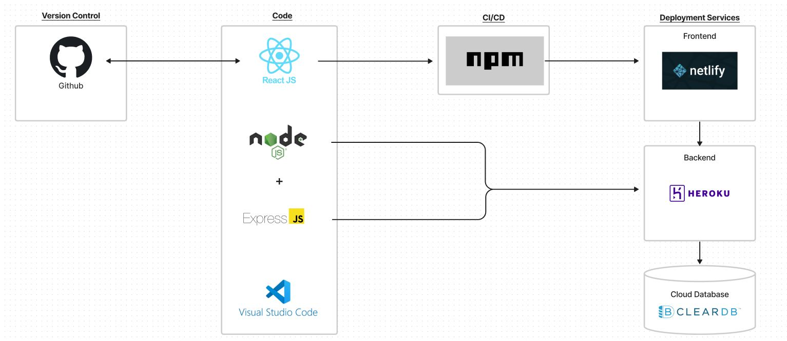

# Kusinanichichi

A simple website for a small family-owned restaurant located in the Philippines that provides affordable food options to the local people. Built and designed using React with HTML/CSS and Bootstrap.

To run:
1. Git clone the project
2. Open the project using Visual Studio Code
3. Open up 2 terminal windows in your Visual Studio Code
4. Navigate into the backend folder (/kusinanichichi/application/backend) in your Visual Studio Code's terminal
5. Run the command: npm i
6. Run the command: node server.js
7. Next, navigate into the frontend folder (/kusinanichichi/application/frontend) in your Visual Studio Code's terminal
8. Run the command: npm i
9. Run the command: npm start
10. The website should start up in your browser.

## Software Architecture Diagram
<picture>
  
</picture>
